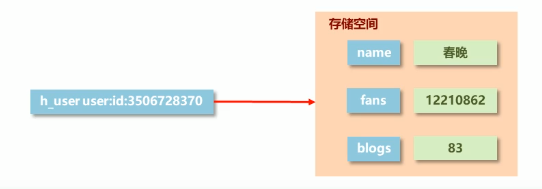
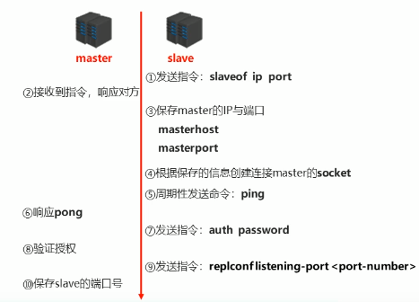
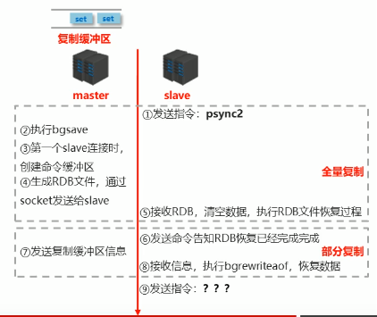
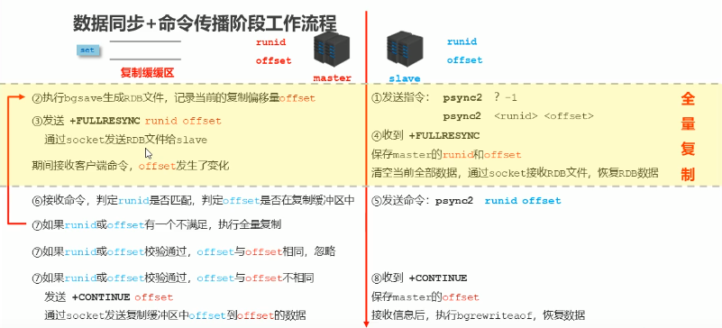

# Redis

---

## Redis 介绍

### NoSQL 技术

在实际项目开发中，我们往往需要面对海量用户和高并发的数据请求。MySQL 等传统关系型数据库面临着两大问题：

1. 磁盘 IO 速度缓慢，单机读写速度不超过 10000 QPS，当数据库无法及时响应高并发的用户请求，请求积压进而导致数据库瘫痪。
2. 数据关系复杂，扩展性差。不适合大规模集群。

因此我们必须引入 NoSQL 技术去解决以上两个问题，以作为关系型数据库的补充。

### Redis 数据库

Redis 是一种**基于内存**的数据库技术。底层采用 C 语言开发，默认端口号 6379。

1. Redis 数据库作为数据缓存，将业务数据直接存储在内存中进行读写，单机读/写速度可达 110000/84000 QPS，可以满足高速响应的需求。
2. Redis 数据库只负责存储数据，数据之间不具有任何关联，易于扩容和伸缩。

### Redis 应用场景

受限于内存的高昂成本，一般我们只使用 Redis 存储高频读写的关键数据。比如：

1. **热点数据**：如热点商品信息。
2. **任务队列**：如秒杀队列、抢购队列。
3. **实时更新信息**：如商品排行榜、公交到站信息。
4. **时效性信息**：如手机验证码、session 、 心跳(heartbeat)。

> Redis 主要适用于内部系统的高频数据。在线上环境负载极大的情况下，使用 Redis 也不足以满足对数据读写的速度要求。

### Redis 基本使用

#### 安装指令

在控制台输入以下指令安装和使用 Redis：

```shell
$ sudo apt-get install redis-server       # 安装 Redis 数据库（仅限 Ubuntu 可用）

$ redis-server                            # 启动 Redis 数据库
$ redis-server --port 6380                # 启动 Redis 数据库，在指定端口
$ redis-server redis-6379.conf            # 启动 Redis 数据库，使用指定配置文件

$ redis-cli                               # 进入 Redis 控制台，在默认端口
$ redis-cli -p 6380                       # 进入 Redis 控制台，在指定端口
```

#### 基础配置

在 Redis 安装目录下的 `redis.conf` 文件是 Redis 默认配置文件，启动 Redis 数据库时默认加载。

```conf
daemonize no                     # 守护线程，打开后启动 Redis 控制台不提示
bind 127.0.0.1                   # 绑定 IP 地址，绑定后只能通过该地址访问 Redis
port 6379                        # 端口号
databases 16                     # 存储区域数量
```

#### 日志配置

Redis 总共支持四个日志级别：debug / verbose / notice / warning ，从前往后日志记录信息逐渐减少。通常情况下开发环境设为
verbose ，生产环境设为 notice 。

```conf
loglevel verbose                 # 日志级别
logfile 6379.log                 # 日志文件名
```

#### 持久化配置

默认使用 RDB 方式持久化数据，相关配置如下：

```conf
save 900 1                            # 自动同步数据条件，900s 内变更 1 个 key 值则持久化
save 300 10                           # 自动同步数据条件，300s 内变更 10 个 key 值则持久化

rdbcompression yes                    # 是否压缩数据，压缩后节省空间但读取较慢
rdbchecksum yes                       # 是否格式校验（默认开启），校验降低文件损坏风险但读取较慢

dbfilename dump.rdb                   # 保存文件名
dir ./                                # 保存文件位置
```

可以在配置文件中改用 AOF 方式持久化数据，刷新文件条件有三种类型： always / everysec / no 。

```conf
appendonly yes                        # 选用 AOF 方式持久化
appendsync everysec                   # 刷新文件条件，每秒更新一次操作日志
```

#### 容量配置

对 Redis 数据库占用空间和客户链接做出限制。

```conf
maxclients 100                        # 客户连接数上限，超出后拒绝客户访问，为 0 表示不限制
timeout 300                           # 客户闲置时长，超出后关闭连接，为 0 表示不关闭

maxmemory 50                          # Redis 最大占用内存比例，为 0 表示全部可用
maxmemory-samples                     # Redis 随机选取数据数量
maxmemery-policy volatile-lru         # Redis 逐出策略
```

#### 多机配置

如果我们要设置集群，则需要进行以下配置：

```conf
cluster enabled yes                        # 开启集群
cluster-config-file nodes.conf             # 集群配置文件
```

如果我们要设置主从服务器，则需要进行以下配置：

```conf
# 主服务器
requirepass 123456                    # 主服务器设置密码（可选）
repl-backlog-size 1mb                 # 缓冲区大小

# 从服务器
slaveof 127.0.0.1 6379                # 主服务器套接字，设置后自动连接
masterauth 123456                     # 主服务器密码
slave-serve-stale-data no             # 同步数据时是否允许读数据
```

---

## Redis 基础

1. 在 Redis 中单个指令都是原子性操作，通过指令操作 Redis 数据时无需担心线程安全问题。

2. Redis 以 key-value 的形式保存数据：key 值一定为 string 类型，而 value 值支持以下五种基础类型：

 数据类型       | 存储形式 
------------|------ 
 string     | 字符串  
 hash       | 哈希表  
 list       | 链表   
 set        | 哈希集  
 sorted_set | 二叉树集 

### 存储区域

Redis 将数据存储分为多个相互独立的区域，将 Redis 操作局限在自己的存储区域内。通常划分为 16 个（编号 0-15），默认使用编号 0 。

```shell
> select 1                         # 改用 1 号存储区域

> dbsize                           # 返回当前区域 key 数量
> move key 2                       # 将当前 key 迁移到 2 号存储区域
> flushdb                          # 清空当前存储区域
> flushall                         # 清空全部存储区域
```

### key 操作

**基本操作**

```shell
> del key                            # 删除 key
> exists key                         # 判断是否存在 key
> type key                           # 返回 key 对应的 value 类型       

> rename key newkey                  # 重命名
> renamenx key newkey                # 重命名（返回 1），新名称已存在则失败（返回 0）
> sort                               # 对 key 排序
```

**时效性控制**

Redis 中可以为 key 设置有效期，key 过期后会由 Redis 执行删除策略回收内存空间。

```shell
> expire key 10                      # key 10s 内有效
> expireat key 1355292000            # key 截至时间戳有效
> persist key                        # key 永久有效

> ttl key                            # 返回 key 剩余有效时间，若不存在返回 -2 ，永久返回 -1
```

**查询操作**

Redis 支持查询存储区域内含有的 key，且允许使用以下通配符：

- `*` 表示任意数量字符
- `?` 表示任意一个字符
- `[]` 表示一个指定字符

```shell
> keys *                             # 查询所有 key
> keys user:*                        # 查询所有 user 的 key
> keys id:75??                       # 查询 ID 为 7500-7599 的 key
> keys id:7[2345]55                  # 查询 ID 为 7255/7355/7455/7555 的 key
```

### 基础类型

#### string 类型

Redis 的 string 类型中，key 值对应的存储空间内将保存一个字符串数据，

key 值标准命名格式为 `表名:主键名:主键值:字段名`，如 `user:id:15942348:name - "王东浩"`。

**基本操作**

```shell
> set key 10                     # 设置键值对
> get key                        # 获取键值，不存在则返回 nil
> del key                        # 删除键值对
> strlen key                     # 获取价值的字符串长度
> append key 0                   # 在键值尾部追加

> mset key1 10 key2 100          # 设置多个数据
> mget key1 key2                 # 获取多个数据

> setex key 10 1                 # 设置键值对，10s 后自动删除
> psetex key 10 1                # 设置键值对，10ms 后自动删除
```

**数据操作**

如果字符串为合法数字，可以当作数字处理。但数值不能超过 shell 中的 long 类型。

```shell
> incr key                       # 键值加一
> decr key                       # 键值减一
> incrby key 10                  # 键值加十
> decrby key 10                  # 键值减十
> incrbyfloat key -1.5           # 键值加 -1.5
```

#### hash 类型

hash 类型中，key 值对应的存储空间内可以保存多个键值对(field-value)：field 和 value
都必须是字符串类型。当键值对较少时存储空间内采用数组存储，当键值对较多时采用哈希存储。

十分适合存储对象，每个键值对记录对象的一个属性。



**基本操作**

```shell
> hset key field 10               # 设置/更新键值对
> hsetnx key field 10             # 如果键值不存在则设置键值对
> hget key field                  # 获取键值
> hgetall key                     # 获取全部键值
> hdel key field                  # 删除键值对
> hlen key                        # 获取键值对数量
> hexists key field               # 判断是否存在字段（返回 1 或 0）

> hmset key field1 1 field2 2     # 设置/修改多个键值对
> hmget key field1 field2         # 获取多个键值对
```

**扩展操作**

```shell
> hkeys key                       # 返回 key 对应的所有 field
> hvals key                       # 返回 key 对应的所有 value

> hincrby key field 1             # 键值加一
> hdecrby key field 1             # 键值减一
```

#### list 类型

list 类型中，key 值对应的存储空间内可以保存多个字符串数据，采用双向链表实现。具有索引的概念，但还是更适合从链表两侧操作。字符串总容量不能超过
2 的 32 次方。

十分适合存储有序信息，比如粉丝列表。

**基本操作**

```shell
lpush list 1                    # 链表左侧插入数据，返回下标
rpush list 2                    # 链表右侧插入数据，返回下标
lpop list                       # 获取并删除最左侧数据
rpop list                       # 获取并删除最右侧数据
blpop list 10                   # 获取并删除最左侧数据，不存在则至多等待 10 s
lrem list 3 x                   # 从左侧开始，删除三个为 x 的数据

lrange list 0 2                 # 返回左侧前3个数据
lrange list 0 -1                # 返回全部数据（常用）
lindex list 0                   # 返回指定位置数据
llen list                       # 返回字符串个数
```

#### set 类型

set 类型中，key 值对应的存储空间内可以保存多个字符串数据，采用哈希存储实现。随机查询效率比 list 类型更高。字符串总容量不能超过
2 的 32 次方。

十分适合存储集合类信息，比如用户感兴趣的话题、用户权限。

**基本操作**

```shell
sadd set member                  # 添加数据（可以是多个）
srem set member                  # 删除数据（可以是多个）
smembers set                     # 展示全部数据  

scard set                        # 返回数据个数
sismember set                    # 判断是否含有数据

srandmember set 5                # 随机从集合中选取 5 个数据
spop set                         # 返回并删除一个随机数据
```

**扩展操作**

```shell
sinter set1 set2                   # 交
sunion set1 set2                   # 并
sdiff set1 set2                    # 差
sinterstore newset set1 set2       # 交且存入新集合
sunionstore newset set1 set2       # 并且存入新集合
sdiffstore newset set1 set2        # 差且存入新集合

smove oldset newset 5              # 数据从旧集合迁移到新集合
```

#### sorted_set 类型

如果我们需要数据查询效率较高且有序，则可以使用 sorted_set 类型。底层和 set 结构相同采用哈希存储（value 值仍不可重复），但在
key-value 存储结构后添加 score 属性为数据排序，默认从小到大。score 是数字且可以使用小数，但如果使用小数浮点类型可能会出现精度丢失。

可以用来存储排行榜等有序数据集合，还可以用于存储时效性或者带有权重的任务队列，用当前时间或者权重作为 score 。

**基本操作**

```shell
zadd set score1 member             # 添加数据且标记序号（可以是多个）
```

### 高级类型

此外，Redis 还提供了 Bitmaps、 HyberLogLog、GEO 三种高级数据类型，用来适配特定的应用场景。

#### Bitmaps 类型

Bitmaps 类型中用作存储布尔值：每个 key 对应若干字节数据（字节数 = 最大编号 / 8），每字节可以存储 8 个 boolean 值。

如果 Redis 要存储大量 boolean 值，使用 Bitmaps 类型可以显著节省内存空间。

```shell
setbit bits 0 1                  # 将 0 位置为 1(true)
getbit bits 0                    # 取 0 位的值
```

#### HyperLogLog 类型

HyperLogLog 类型用作数据统计，只记录数量不保存数据，且当数据量巨大时存在误差！

使用 HyperLogLog 类型可以显著节省内存空间，每个 key 仅占用 12k 内存标记基数。

```shell
setbit bits 0 1                  # 将 0 位置为 1(true)
getbit bits 0                    # 取 0 位的值
```

#### GEO 类型

GEO 类型用作地理位置计算，根据经纬度。


---

## Redis 高级

### 持久化

Redis 使用内存存储，一旦断电可能会导致数据丢失。因此需要将数据保存到永久性存储介质中，防止数据意外丢失。

*如果 Redis 负责为数据库高热度数据访问加速或者一些其他业务（数据库中有重复数据），那么没必要为 Redis 数据持久化。*

Redis 持久化有以下两种方式：

#### 数据快照 RDB

**定时将全部数据存入文件**。存储速度慢但是恢复数据的速度很快，如果保存不及时仍会丢失少量数据。

数据以二进制形式默认存储在 `安装目录/data/dump.rgb` 文件。如果 Redis 数据库被关闭，下次重启时会从该文件读取数据。

**手动存储**

```shell
save                      # 数据存入文件（会阻塞 Redis 数据库，导致其他指令无法执行）
bgsave                    # 数据存入文件（Redis 数据库调创建单独进程完成指令）

debug reload              # 重启 Redis，且关闭时将数据存入文件
shutrown save             # 关闭 Redis，且关闭时将数据存入文件
```

**修改配置**

在 `安装目录/conf/redis-6379.conf` 配置文件内可以修改默认配置：

- 如果操作系统内安装了多个 Redis 数据库（使用不同的端口），必须通过修改存储文件名加以区分。

```shell
dir data2                            # 修改存储路径（默认 data） 
dbfilename dump-6379.rgb             # 修改存储文件名（默认 dump.rgb）
rdbcompression no                    # 关闭数据压缩（默认开启），读取文件加快但文件会变大
rdbchecksum no                       # 关闭格式校验（默认开启），读取文件加快但存在文件损坏风险
stop-writes-on-bgsave-error no       # 后台存储出现错误不停止（默认停止）
```

- 通过修改配置文件，可以让 Redis 数据库可以自动调用 bgsave 指令更新 RDB 文件。

```shell
save 100 10                          # 自动存储（100s 内发生 10 个 key 数据变化时触发）
```

#### 日志记录 AOF

**将对数据的操作过程存入文件**。这种方式刷新更频繁因此丢失数据概率更低，但恢复数据的速度比 RDB 方式更慢，占用存储空间也更大。

数据以二进制形式默认存储在 `安装目录/data/appendonly.aof` 文件。如果 Redis 数据库被关闭，下次重启时会根据该文件恢复数据。

**文件重写**

随着命令不断写入 AOF ，AOF 文件会越来越大，占用内存增多、恢复数据也会变慢。因此 Redis 需要对 AOF 文件进行重写，合并指令记录。

```shell
rewriteaof                          # 重写 AOF 文件（会阻塞 Redis 数据库，导致其他指令无法执行）
bgrewriteaof                        # 重写 AOF 文件（Redis 数据库调创建单独进程完成指令）                        
```

**修改配置**

AOF 不是默认持久化方式，需要在 `安装目录/conf/redis-6379.conf` 配置文件内修改默认配置：

- 必须通过配置文件开启并配置 AOF 存储。

```shell
appendonly yes                        # 选用 AOF 方式持久化

appendsync always                     # 每次操作刷新文件：非常频繁，损耗性能
appendsync everysec                   # 每秒刷新文件（默认）
appendsync no                         # 手动刷新文件
```

- 修改路径和文件名的操作和 RDB 方法类似。

```shell
dir data2                             # 修改存储路径（默认 data） 
dbfilename appendonly-6379.aof        # 修改存储文件名（默认 appendonly.aof）
```

- 通过修改配置文件，可以让 Redis 数据库自动调用 bgrewriteaof 指令重写 AOF 文件。

```shell
略，之后补充
```

### 事务

假如我们通过多个操作执行一次购物，如果在这个过程中还执行了其他操作，可能导致我们的购物过程出现意想不到的错误。

因此我们引入事务的概念，将多个操作看作一个不可分割的整体，统一执行而不会被其他操作打断。

```shell
multi                     # 开启事务，之后的命令不再立刻执行、而是进入任务队列

# 输入事务内的命令

exec                      # 执行事务，执行任务队列里的命令
discard                   # 取消事务，清空任务队列
```

1. 如果事务中包含语法错误（不能识别的命令），所有的命令都不会执行。
2. 如果事务中包含无法执行的命令，仅有出错的命令将不会被执行，其他被执行的命令需要开发者自行回滚。

#### 锁

在事务准备的过程中，如果执行的其他操作导致触发事务的条件发生了变化，这个时候就不应该继续执行事务。

我们引入了锁的概念来监视特定 key，在执行事务前如果其 value 发生了变化则终止事务执行。

```shell
watch key1 key2            # 监视 key，书写在 multi 命令前
unwatch                    # 取消监视 key，书写在 multi 命令前

# 在之后执行事务
```

#### 分布式锁

如果 key 值变化极为频繁，那么使用普通锁会导致事务一直被终止。我们引入了分布式锁的概念，在加锁期间不允许其他进程对该值修改。

```shell
setnx lock-num 1               # 对 key(num) 加公共锁，其他线程不能对其进行操作。成功则返回 1，若已有锁导致失败返回 0

# 输入命令或者事务

del lock-num                   # 对 key(num) 解公共锁
```

分布式锁如果长期不被释放，就会出现死锁，导致其他操作无法继续执行。我们可以对分布式锁计时。**计时分布式锁常用于多部署平台统一竞争锁。
**

```shell
expire lock-num 10                # 对 key(num) 加公共锁，10s 后自动释放
pexpire lock-num 10               # 对 key(num) 加公共锁，10ms 后自动释放
```

### 删除策略

Redis 中每个存储区域除了存储 key-value 值，还会开辟额外的存储空间 expires 记录每个 key-value 的存储地址以及过期时间。如果
key 过期或被删除指令删除，那么 Redis 要执行删除策略清理内存空间。

Redis 删除策略有以下三种方式，主要使用惰性删除和定期删除两种方式。

1. **定时删除**

key 过期后，存储 key-value 的内存地址立即被清空。

节省内存资源，但可能抢占处在繁忙状态的 CPU。

2. **惰性删除**

key 过期后不做任何处理。访问 key 时才检查是否过期，如果过期存储该 key-value 的内存地址才被清空。

节省 CPU 资源，但过期键值对可能大量占用内存。

3. **定期删除**

对于 16 个存储区域的 expires 进行轮询，对选中的 expires 随机选择 W 个 key 进行检查，如果 key 过期就进行删除。

- 如果过期 key 超过 25%，那么重复检查该 expires 存储区域。
- 如果过期 key 少于 25%，那么按顺序检查下一个 expires 存储区域。

### 逐出策略

如果 Redis 使用内存空间前会检查内存容量。如果已被占满，那么 Redis 要执行逐出策略删除部分数据，以清理内存空间执行指令。

在选取删除数据时 Redis 并不会扫描全库数据，而是随机选取部分数据检测并从中删除：以节省 CPU 性能。

响应配置如下：

```shell
maxmemory 50                            # Redis 最大占用内存比例，默认为 0（全部可用）
maxmemory-samples                       # Redis 随机选取数据数量
maxmemery-policy volatile-lru           # Redis 逐出策略
```

Redis 逐出策略有以下三种方式，在配置文件中配置即可。

1. **检查会过期数据**

- `volatile-lru` ：（推荐）挑选最久未使用的数据淘汰。
- `volatile-lfu` ：挑选最近一段时间使用频率最低的数据淘汰。
- `volatile-ttl` ：挑选将要过期的数据淘汰。
- `volatile-random` ：随机挑选数据淘汰。

2. **检查全部数据**

- `allkeys-lru` ：挑选最久未使用的数据淘汰。
- `allkeys-lfu` ：挑选最近一段时间使用频率最低的数据淘汰。
- `allkeys-random` ：随机挑选数据淘汰。

3. **不逐出数据**

- `no-enviction` ：（默认）抛出错误 Out Of Memery。

---

## Redis 多机

### 集群

当数据量过大时，单个 Redis 数据库就无法存放。我们需要多个 Redis 数据库组成集群(cluster)，去分别**存放不同的数据**。

1. key-value 数据进行存入时，会根据 key 的哈希值对 16384 取模，放入相应的槽(slot)存放。这 16384 个槽会分发给各个存储空间。

2. 各个存储空间之间会相互通信，并记录所有编号的槽都存储在哪个存储空间：保证最多访问 Redis 两次可以命中。

**配置文件**

```shell
cluster enabled yes                            # 开启集群
cluster-config-file nodes-6379.conf            # 集群配置文件（默认为 nodes.conf）
```

**集群指令**

- 通过 `redis-cli` 打开 Redis 集群中的数据库，输入指令去插入不属于这个存储空间的键值，会返回错误。

- 通过 `redis-cli -c` 打开 Redis 集群中的数据库，会自动将插入数据指令转发到相应的存储空间。

### 主从复制

如果数据只交给一个 Redis 服务器处理，那么可能面临两大问题：

1. 服务器同时处理过多读写操作，超过服务器负载。
2. 一旦服务器宕机，就会导致服务异常中断。

为了避免这两个问题，我们必须引入多个 Redis 服务器来保存相同数据，并采用主从复制结构：一个主服务器 Master 对应多个从服务器
Slave 。

1. **读写分离**：Master 负责写入数据；Slave 则会自动同步数据，并负责读取数据。起到均衡负载的作用。
2. **数据冗余**：即使某个 Slave 故障，由于其他 Slave 已保存了这些数据，并不会导致服务中断。

#### 容错机制

- 主从之间使用**心跳**建立连接。 Slave 每秒 ping 一次，汇报自己的偏移量、获取最新的指令。Master 默认每 10s ping 一次 Slave，
  检查 slave 是否在线：如果 Slave 多数掉线或者高延迟，Master 停止写和数据同步功能，保障数据稳定性。

- 在分布式系统里还会部署多个 Redis 服务器作为**哨兵**（除端口号外完全相同），不提供数据服务，只负责监控主从机制的运行：如果发现
  Master 宕机，哨兵将通知所有机器，使 Master 下线并开启投票机制选用一个 Slave 担任 Master 。

#### 配置连接

Master 和 Slave 通过以下过程建立连接。



相比于输入指令，我们一般直接修改 conf 文件夹内的配置文件，由机器自动建立连接。

```shell
# Master 
requirepass 123456                # 连接主服务器需要密码（可选）

# Slave
slaveof 127.0.0.1 6379            # 根据套接字自动连接主服务器
masterauth 123456                 # 主服务器密码
```

#### 数据同步

Slave 会定期复制 Master 的持久化文件，以保证数据同步。



**复制缓冲区**：一个先入先出队列，用来存储 AOF 形式指令。由偏移量记录当前执行到的位置。

- 如果开启 AOF ，在创建时就会开启复制缓冲区。（偏移量记录自己执行到的位置）
- 如果使用 RDB ，在成为 Master 时会开启复制缓冲区。（Master 可以含有多个偏移量，记录不同 Slave 读取到的位置。）

*如果 Slave 过多，数据同步也会导致 Master 负载过高。因此 Slave 也可以兼职 Master，向下级 Slave
提供服务。但层次太多会导致数据延迟，慎用。*

1. 数据同步阶段应避免流量高峰期，防止影响业务正常执行；也不要多个从服务器同时同步数据。
2. 缓冲区应该足够大，否则一旦发生数据溢出会反复进行全量复制。

```shell
# Master
repl-backlog-size 2mb                 # 修改缓冲区大小（默认 1mb）

# Slave
slave-serve-stale-data no             # 不允许同步数据时读数据
```

#### 命令传播

服务器每次启动都会随机生成一个运行 ID（40 位 16 进制字符） ，Master 和 Slave 之间正是依靠 Master 的运行 ID 相互识别。




---

## Redis 潜在问题

### 缓存故障

Redis 缓存技术常用于高并发情况下，有效减轻服务器和数据库负载。如果 Redis 出现问题导致无法均衡负载，就可能导致服务崩溃。

1. **缓存预热**

当系统刚启动时，**由于 Redis 尚未保存数据导致无法命中**，数据库被频繁请求数据，由于过载导致数据库崩溃。

数据库崩溃后， Redis 和应用服务器无法获取数据，请求积压会进一步导致 Redis 和服务器崩溃。

2. **缓存雪崩**

当流量激增时，**如果 Redis 大量 key 过期导致无法命中**，数据库被频繁请求数据，由于过载导致数据库崩溃。

数据库崩溃后， Redis 和应用服务器无法获取数据，请求积压会进一步导致 Redis 和服务器崩溃。

3. **缓存击穿**

当流量激增时，**如果 Redis 某个极高热度的 key 过期导致无法命中**，数据库被频繁请求数据，由于过载导致数据库崩溃。

数据库崩溃后， Redis 和应用服务器无法获取数据，请求积压会进一步导致 Redis 和服务器崩溃。

4. **缓存穿透**

当流量激增时，**如果 Redis 收到大量非法访问导致无法命中**，数据库被频繁请求数据，由于过载导致数据库崩溃。

数据库崩溃后， Redis 和应用服务器无法获取数据，请求积压会进一步导致 Redis 和服务器崩溃。

### 一致性问题

如果在缓存中存储数据库数据备份，以提高查询效率，就一定会出现一致性问题，导致脏读。比如数据库中数据从 1 更新到 10
，但缓存还未更新时读取，就会读取到 1。这个问题难以避免。

1. 缓存就是缓存，必须要设过期时间。
2. 实时性要求比较高的（比如充值），直接读数据库。
3. 数据库并发高需要分库分表。

---

## Redis 客户端

我们在实际使用 Redis 时往往要通过 Redis 客户端，以便在程序中直接操作 Redis 。常使用的 Redis 客户端有 Jedis、 以及功能更为高级的
Redisson、Lettuce 等。

### RedisTemplate 类

Spring Boot 提供了 RedisTemplate 工具类直接对 Redis 进行操作，也提供了 StringRedisTemplate 类继承 RedisTemplate
类，两者方法完全一致。

- `RedisTemplate` 类：存储数据时序列化成字节数组保存，在 Redis 中数据为字节码。读取数据时自动转化为对象。
- `StringRedisTemplate` 类：存储数据直接以字符串形式保存，在 Redis 中数据直接可读。只适用于字符串类型的数据。

由于两种序列化方法不同导致的数据存储形式差异，两个类之间不能对另一方存储的 Redis 数据进行操作。

**常用方法**

```java
/* 直接对 key 操作 */
redisTemplate.delete("key");                                             // 删除 key
redisTemplate.delete(collection);                                        // 批量删除 key
redisTemplate.expire("key",10,TimeUnit.MINUTES);                         // 设置 key 失效时间
Long expire = redisTemplate.getExpire("key");                            // 获取 key 失效时间
boolean flag = redisTemplate.hasKey("key");                              // 判断 key 是否存在

/* 操作字符串 */
redisTemplate.opsForValue().set("key", "value");                         // 设置键值对 
String str = (String)redisTemplate.opsForValue().get("key");             // 获取键值

/* 操作 hash */
redisTemplate.opsForHash().put("HashKey", "SmallKey", "HashValue");                  // 设置键值对
redisTemplate.boundHashOps("HashKey").putAll(hashMap);                               // 批量设置键值对
String value = (String) redisTemplate.opsForHash().get("HashKey", "SmallKey");       // 获取键值
Map entries = redisTemplate.opsForHash().entries("HashKey");                         // 获取全部键值对
redisTemplate.boundHashOps("HashKey").delete("SmallKey");                            // 删除键值对
Boolean isEmpty = redisTemplate.boundHashOps("HashKey").hasKey("SmallKey");          // 是否含有键值对


redisTemplate.opsForList();　　 // 操作 list
redisTemplate.opsForSet();　　  // 操作 set
redisTemplate.opsForZSet();　 　// 操作有序 set
```

### Jedis 客户端

Jedis 基于 Java 实现，是 shell 程序连接 Redis 数据库最常使用的工具。提供了比较全面的 Redis 命令的支持。

- Jedis 使用阻塞 I/O，且其方法调用都是同步的，程序流需要等到 sockets 处理完 I/O 才能执行。
- Jedis 采取直连模式，在多个线程间共享一个 Jedis 实例线程不安全，多线程操作 Redis 必须要使用多个 Jedis 实例。

1. **导入依赖**

Spring Boot 2.x 版本 Redis 默认导入了 lettuce，需要排除才能使用 Redis .

```xml
<!-- Redis -->
<dependency>
    <groupId>org.springframework.boot</groupId>
    <artifactId>spring-boot-starter-data-redis</artifactId>
    <exclusions>
        <exclusion>
            <groupId>io.lettuce</groupId>
            <artifactId>lettuce-core</artifactId>
        </exclusion>
    </exclusions>
</dependency>
<!-- Jedis -->
<dependency>
    <groupId>redis.clients</groupId>
    <artifactId>jedis</artifactId>
</dependency>
```

2. **基本使用**

使用引入的 Jedis 类即可连接 Redis 数据库并进行操作。操作名取自 Redis 指令，如果出现问题则会抛出 JedisDataException。

```java
import redis.clients.jedis.Jedis;

public class JedisTest{
    @Test
    public void jedisTest (){
        // 连接 Redis
        Jedis jedis = new Jedis("127.0.0.1", 6379);    
        // 对 Redis 操作（直接使用 Redis 指令）
        try {
            jedis.set("name", "MrJoker");                  
            System.out.print(jedis.get("name"));  
        } catch(JedisDataException e) {
            System.out.print("error");  
        } finally {
            // 关闭 Redis 连接
            jedis.close();    
        }                                          
    }
}
```

在实际开发中，创建多个 Redis 连接会非常复杂且难以管理，Jedis 提供了 JedisPool 类作为 Redis 连接池来管理 Redis 连接。

```java
import redis.clients.jedis.JedisPool;
import redis.clients.jedis.JedisPoolConfig;

public class JedisTest{
    @Test
    public void jedisTest (){
        // 配置连接池
        JedisPoolConfig poolConfig = new JedisPoolConfig();
        poolConfig.setMaxIdle(50);                 // 最大空闲数
        poolConfig.setMaxTotal(100);               // 最大连接数
        poolConfig.setMaxWaitMillis(20000);        // 最大等待毫秒数   
        // 创建连接池
        JedisPool pool = new JedisPool(poolConfig, "localhost");
        // 从连接池中获取单个连接
        Jedis jedis = pool.getResource();
        // 如果需要密码
        //jedis.auth("password");                                 
    }
}
```

3. **Spring Boot 集成**

Spring Boot 中，我们无需自行创建 Redis 连接，只需要在配置文件中配置好参数。

```properties
# REDIS配置
# Redis数据库索引（默认为0）
spring.redis.database=0
# Redis服务器地址
spring.redis.host=localhost
# Redis服务器连接端口
spring.redis.port=6379
# Redis服务器连接密码（默认为空）
spring.redis.password=
# 连接池最大连接数（使用负值表示没有限制）
spring.redis.pool.max-active=8
# 连接池最大阻塞等待时间（使用负值表示没有限制）
spring.redis.pool.max-wait=-1
# 连接池中的最大空闲连接
spring.redis.pool.max-idle=8
# 连接池中的最小空闲连接
spring.redis.pool.min-idle=0
# 连接超时时间（毫秒）
spring.redis.timeout=0
```

Spring Boot 提供默认的 RedisTemplate 工具类根据配置文件自动连接 Redis，自动加载后可以直接调用其中的方法去操作。

```java
@RunWith(SpringJUnit4ClassRunner.class)
@SpringBootTest()
public class ApplicationTests {

    @Autowired
    private RedisTemplate redisTemplate;

    @Test
    public void test() throws Exception {
        User user = new User();
        user.setName("我没有三颗心脏");
        user.setAge(21);
        // 调用工具类方法
        redisTemplate.opsForValue().set("user_1", user);
        User user1 = (User) redisTemplate.opsForValue().get("user_1");
        System.out.println(user1.getName());
    }
}
```

**RedisTemplate 类常用操作**

```java
redisTemplate.delete(key);                                   // 删除 key
redisTemplate.delete(keys);                                  // 批量删除 key
redisTemplate.expire(key,time,TimeUnit.MINUTES);             // 设置 key 失效时间
Long expire = redisTemplate.getExpire(key);                  // 获取 key 失效时间
```

### Lettuce 客户端

更加高级的 Redis 客户端，用于线程安全同步，异步和响应使用，支持集群，Sentinel，管道和编码器。

- 基于 Netty 框架的事件驱动的通信层，其方法调用是异步的。不用浪费线程等待网络或磁盘 I/O。
- Lettuce 的 API 是线程安全的，所以可以操作单个 Lettuce 连接来完成各种操作。

1. **导入依赖**

在 spring boot 2.x 版本，为 Redis 默认导入了 Lettuce 。

```xml
<!-- Redis 默认导入 Lettuce -->
<dependency>
    <groupId>org.springframework.boot</groupId>
    <artifactId>spring-boot-starter-data-redis</artifactId>
</dependency>
```

如果 Spring Boot 版本过低，也可以自行导入 Lettuce. Redis 版本至少需要 2.6 .

```xml
<!-- 单独导入 Lettuce -->
<dependency>
    <groupId>org.springframework.boot</groupId>
    <artifactId>spring-boot-starter-data-redis</artifactId>
</dependency>
<dependency>
    <groupId>io.lettuce</groupId>
    <artifactId>lettuce-core</artifactId>
    <version>5.1.8.RELEASE</version>
</dependency>
```

2. **基本使用**

```java
public class LettuceTest {
    @Test
    public void testSetGet() throws Exception {
        // 注册连接信息
        RedisURI redisUri = RedisURI.builder()                    
                .withHost("localhost")
                .withPort(6379)
                .withTimeout(Duration.of(10, ChronoUnit.SECONDS))
                .build();
        // 创建 Redis 客户端
        RedisClient redisClient = RedisClient.create(redisUri);   
        // 创建连接
        StatefulRedisConnection<String, String> connection = redisClient.connect();     
        // 创建同步命令
        RedisCommands<String, String> redisCommands = connection.sync();                
        SetArgs setArgs = SetArgs.Builder.nx().ex(5);
        String result = redisCommands.set("name", "throwable", setArgs);
        Assertions.assertThat(result).isEqualToIgnoringCase("OK");
        result = redisCommands.get("name");
        Assertions.assertThat(result).isEqualTo("throwable");
        /******************** 其他操作 **********************/
        connection.close();                     // 关闭连接
        redisClient.shutdown();                 // 关闭客户端
    }
}
```

Lettuce 主要提供三种API：同步（sync）`RedisCommands`、异步（async）`RedisAsyncCommands`
、反应式（reactive）`RedisReactiveCommands`。

3. **Spring Boot 集成**

同样在配置文件中配置好参数。

```properties
spring.redis.host=localhost
spring.redis.port=6379
spring.redis.password=root
# 连接池最大连接数(使用负值表示没有限制) 默认为8
spring.redis.lettuce.pool.max-active=8
# 连接池最大阻塞等待时间(使用负值表示没有限制) 默认为-1
spring.redis.lettuce.pool.max-wait=-1ms
# 连接池中的最大空闲连接 默认为8
spring.redis.lettuce.pool.max-idle=8
# 连接池中的最小空闲连接 默认为 0
spring.redis.lettuce.pool.min-idle=0
```

我们同样可以使用 Spring Boot 提供默认的 RedisTemplate 工具类根据配置文件自动连接
Redis。但默认情况下的模板只支持 `RedisTemplate<String,String>` 存入字符串，因此我们往往需要自定义 RedisTemplate
设置序列化器，以方便操作实例对象。

```java
@Configuration
public class RedisConfig {
    @Bean
    public RedisTemplate redisTemplate(RedisConnectionFactory factory) {
        RedisTemplate<String, Serializable> redisTemplate = new RedisTemplate<>();
        // key 采用 String 的序列化方式
        redisTemplate.setKeySerializer(new StringRedisSerializer());
        // value 采用 jackson 的序列化方式
        redisTemplate.setValueSerializer(new GenericJackson2JsonRedisSerializer());
        // hash 采用 String/jackson 的序列化方式
        redisTemplate.setHashKeySerializer(stringRedisSerializer);
        redisTemplate.setHashValueSerializer(jackson2JsonRedisSerializer);
        redisTemplate.setConnectionFactory(connectionFactory);
        return redisTemplate;
    }
}
```

完成后即可用自定义的 RedisTemplate 工具类对 Redis 进行操作。

```java
@RunWith(SpringRunner.class)
@SpringBootTest
public class RedisTest {

    @Autowired
    private RedisTemplate<String, Serializable> redisTemplate;

    @Test
    public void test() {
        String key = "user:1";
        redisTemplate.opsForValue().set(key, new User(1,"pjmike",20));
        User user = (User) redisTemplate.opsForValue().get(key);
    }
}
```

---

## 参考链接

- Lettuce
  https://www.cnblogs.com/throwable/p/11601538.html
  https://juejin.im/post/6844903681087930375