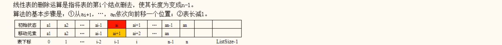
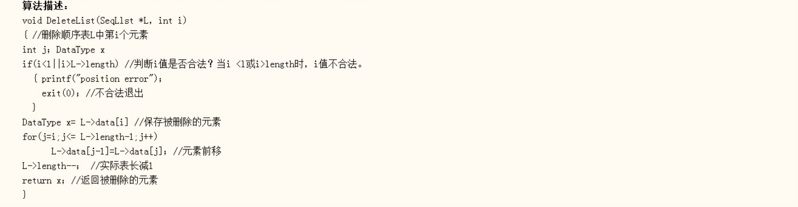

# 线性表

## 线性表的逻辑定义

### 线性表定义

**线性表(Linear. List)**是一种典型的线性结构结构，它是由n个数据元素(结点) a1，a2，······，an
组成的有限序列。其中，数据元素的个数n为表的长度。当n为零时称为空表，非空的线性表通常记为(a1，a2, ······ ，ai-1, ai, ai+1,
······，an)

### 线性表的特征

对于一个非空的线性表:
①有且仅有一个称为开始元素的a1.它没有前趋，仅有一个直接后继a2;
②有且仅有一个称为终端元素的an,它没有后继，仅有一个直接前趋:
③其余元素ai(2 ≤ i ≤ n-1)称为内部元素，它们都有且仅有一个直接前趋ai-i和- 一个直接后继ai+1.

### 线性表的基本运算

(1)置空表 InitList() ,构造一个空的线性表L。
(2)求表长 ListLength(L) ,返回线性表L中元素个数，即表长。
(3)取表中第1个元素 GetNode(L，i), 若1 < i < ListLength(L), 则返回第i个元素ai.
(4)按值查找 LocateNode(L，x). 在表L中查找第一个值为x的元素，并返回该元素在表L中的位置，若表中没有元素的值为x，则返回0值。
(5)插入 InsertList(L, i, x),在表L的第i元素之前插入一个值为x的新元素，表L的长度加1.
(6)删除 DeleteList(L，i), 删除表L的第1个元素，表的长度减1。
实际遇到的复杂运算可以由有各种基本运算组合实现。

## 线性表的顺序存储

### 顺序表的概念

#### 线性表的顺序存储结构

线性表的顺序存储指的是将线性表的数据元素按其逻辑次序依次存入一组地址连续的存储单元里， 用这种方法存储的线性表称为顺序表。

当顺序表中每个结点占用 d (d≥1) 个存储单元，而且已知起始结点 a1 的存储地址是 Loc (a1) ，通常称为基地址。

则可以通过下列公式求得任一结点 ai的存储地址Loc (ai) : `Loc (ai) = Loc (a1) + (i-1) *d`

线性表的这种机内表示称为线性表的顺序存储结构。它的特点是，元素在表中的相邻关系，在计算机内也存在着相邻的关系。

只要确定了线性表存储的起始位置，线性表中任意一个元素都可以随机存取，所以顺序表是一种随机存取结构（同一时间可以访问其中的一个随意接待）

### 顺序表上基本运算的实现

#### 插入运算

线性表的插入运算是指在线性表的第 i -1 个元素和第 i 个元素之间插入一个新元素x。算法的基本步骤是:

①将结点 ai，····· ，an 各后移一位，以便腾出第 i 个位置

②将x置入该空位

③表长加1

此外，必须在上述各步之前判断参数 i 插入位置是否合法。

①合法的插入位置共 n+1 个，即第1个位置到到第nt1个位置。
②最坏情况是插入到第 1 个位置，共需要移动 n 个元素。故插入算法的最坏情况时间复杂性是 O(n)。
③最好情况是插入到第 n+1 个位置，不需要移动元素。
④在插入位置等概率情况下，平均移动元素的个数为。

`( n + ( n - 1 ) + ( n - 2) + ······ + 2 + 1 + 0 ) / ( n + 1 ) = n / 2`

故插入算法平均时间复杂性是 O(n)。

#### 删除运算

同添加：时间复杂度是 O(n)。

## 线性表的链式存储结构

### 单链表（线性链表）

### 单链表的基本运算

### 循环链表

### 双向链表

## 顺序表和链表的比较

